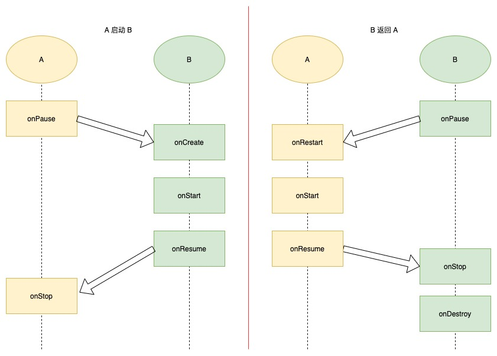

# Activity

[TOC]

## 启动模式

- standard 在task上创建新的实例
- singleTop 检查task顶是否是目标Activity
    - 是 复用，并调用onNewIntent
    - 否 创建新实例
- singleTask 检查目标taskAffinity 中是否有目标实例
    - 有 复用，并调用onNewIntent
    - 否 创建新实例
- singleInstance 在独立的task中，保持唯一

## 生命周期

## 参考

- [Android——你所忽略的launchMode之singleTask与taskAffinity - 简书](https://www.jianshu.com/p/0b908b0624e4)