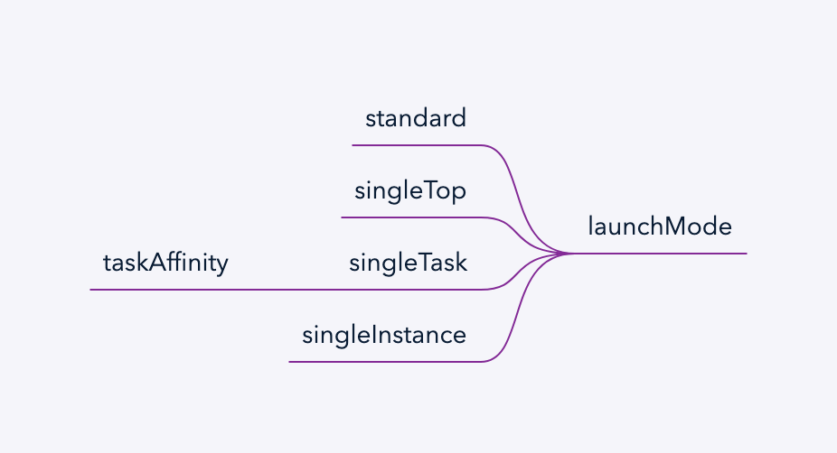

# Activity

## 启动模式

- standard 在task上创建新的实例
- singleTop 检查task顶是否是目标Activity
    - 是 复用，并调用onNewIntent
    - 否 创建新实例
- singleTask 检查目标taskAffinity 中是否有目标实例
    - 有 复用，并调用onNewIntent
    - 否 创建新实例
- singleInstance 在独立的task中，保持唯一