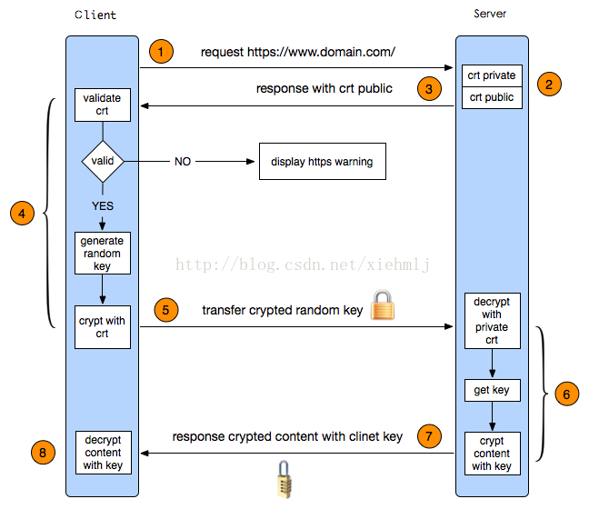

# HTTP/HTTPS

## 简介

HTTP和HTTPS都是应用层协议，只不过HTTPS在应用层和传输层之间加了一层加密层。

- **HTTP** Hypertext Transfer Protocol 
- **HTTPS** Hypertext Transfer Protocol Secure 

## HTTP3.0

3.0中，HTTP把下面的tcp替换成了quic协议。这个协议是基于UDP的，能够在现代网络环境下充分利用带宽。

## HTTPS连接过程

先来一张图：

1. client从服务端请求证书
2. client基于证书信任链检验证书是否合法
3. client从证书中取出公钥，把一个随机字符串key加密发送给server
4. server解密请求，获得key
5. 双方用key来加密通信数据

## 参考

- [HTTP发展史（HTTP1.1，HTTPS，SPDY，HTTP2.0，QUIC，HTTP3.0）](https://juejin.cn/post/6844903988953874445#heading-5)
