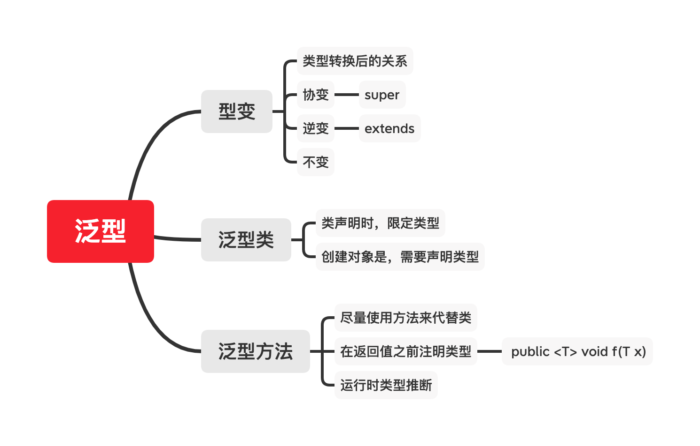

# 泛型

## 泛型是什么

泛型的定义就是类型化参数。由于 Java 是一种强类型语言，在代码执行过程中用到的所有变量，都需要在代码编写的时候指定，这就导致 Java 损失了一些灵活性。因此在 JDK5 中补充了泛型，允许某些变量的类型在执行过程中才会被明确。

## 知识点

先看一张图



### 泛型的使用

通常有两种：

1. 泛型类。 Java中的容器大都是这种状况，使用的时候需要声明具体类型。

    ```java
    
    public class MaximumTest
    {
       // 比较三个值并返回最大值
       public static <T extends Comparable<T>> T maximum(T x, T y, T z)
       {                     
          T max = x; // 假设x是初始最大值
          if ( y.compareTo( max ) > 0 ){
             max = y; //y 更大
          }
          if ( z.compareTo( max ) > 0 ){
             max = z; // 现在 z 更大           
          }
          return max; // 返回最大对象
       }
    }
    
    ```

    

2. 泛型方法

    ```java
       // 泛型方法 printArray                         
       public static < E > void printArray( E[] inputArray ){
          // 输出数组元素            
             for ( E element : inputArray ){        
                System.out.printf( "%s ", element );
             }
             System.out.println();
        }
    ```

    

### 通配符

Java中泛型通常用`?`来指代类型，用`super`和`extend`来限定类型的范围。通常描述为

- super 决定类型的下限，也就是**逆变**
- extend 决定类型的上限，也就是**协变**

#### 型变的挑选 PECS

关于型变，有个**PECS原则**，也就是：**Producer Extends Consumer Super**

这里涉及两个概念：生产者和消费者

- 生产者 如果一个泛型，我们直往外取东西，则可以称之为生产者
- 消费者 如果一个泛型，通常是用来往里放东西，则可以称之为消费者

这样就可以保证，当我们从一个泛型中取数据的时候，至少是某种类型。而往一个泛型里放东西的时候，则可以保证放进去是安全的。

## 参考资料

- [java - What is PECS (Producer Extends Consumer Super)? - Stack Overflow](https://stackoverflow.com/questions/2723397/what-is-pecs-producer-extends-consumer-super)